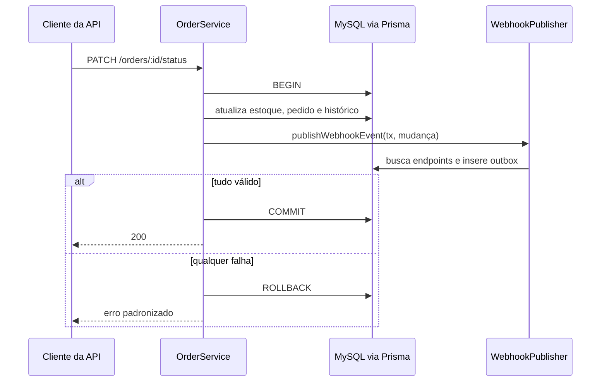
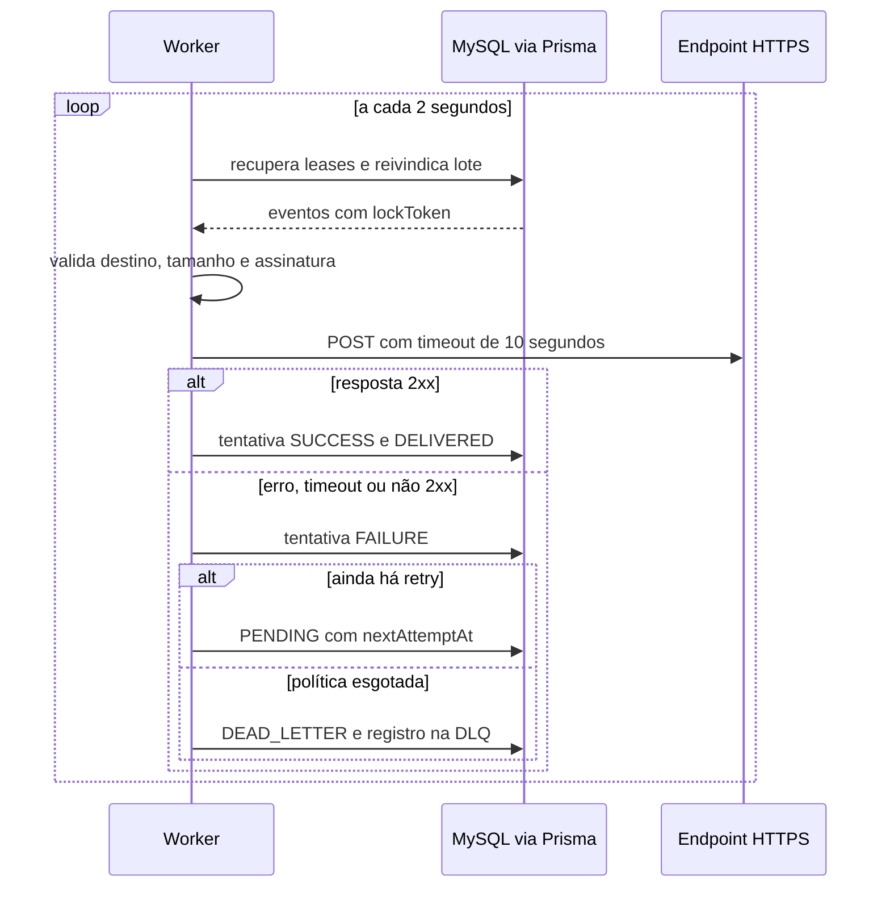
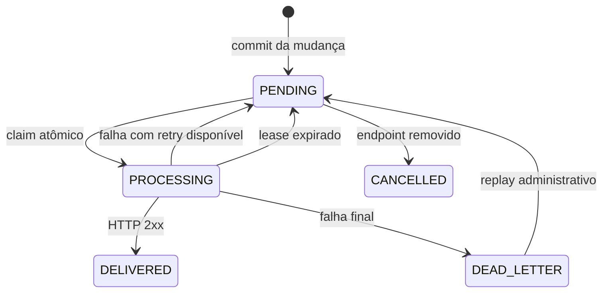

### FDD: Webhooks de notificação de mudanças de status de pedidos

Versão: 1.0
Data: 18 de setembro de 2026
Responsável: Bruno, Engenharia de Pedidos

---

### 1. Contexto e motivação técnica

Clientes B2B consultam pedidos repetidamente para descobrir mudanças de status. A feature
substituirá esse polling por notificações outbound iniciadas pela plataforma. O requisito de
latência é iniciar a primeira entrega em menos de 10 segundos em condições normais.

A implementação seguirá as decisões do [RFC](RFC.md) e dos
[ADRs](adrs/README.md): outbox transacional no MySQL, worker separado, retry com backoff, DLQ,
HMAC-SHA256 por endpoint e entrega at-least-once. O módulo de pedidos continuará responsável pelas
regras de status e estoque. O módulo de webhooks será responsável por configuração, publicação,
entrega, segurança e histórico.

**Atores**

- operador autenticado, que administra webhooks dos clientes aos quais possui acesso;
- administrador, que pode acessar qualquer cliente e executar replay da DLQ;
- `OrderService`, que publica eventos dentro da transação de mudança de status;
- worker, que reivindica e entrega eventos;
- consumidor externo, que valida a assinatura e deduplica por `event_id`.

**Suposições e restrições**

- a primeira versão emite apenas `order.status_changed` a partir de `changeStatus`;
- a criação do pedido em `PENDING` não emite webhook;
- existe uma única instância ativa do worker;
- cada endpoint interessado gera um evento e um `event_id` próprios;
- o payload é um snapshot e não é recalculado durante retry ou replay;
- o worker e a API usam a mesma versão do schema Prisma e o mesmo MySQL;
- não existe transação distribuída com o consumidor;
- o vínculo entre usuário e cliente ainda não existe no schema atual e será incluído nesta entrega.

---

### 2. Objetivos técnicos

- Persistir a mudança de status e todos os eventos correspondentes na mesma transação Prisma.
- Não gerar evento se a mudança do pedido sofrer rollback.
- Iniciar a primeira tentativa em menos de 10 segundos em condições normais.
- Limitar cada chamada externa a 10 segundos.
- Oferecer at-least-once com `event_id` estável em tentativa, retry, DLQ e replay.
- Autenticar os bytes exatos do corpo com HMAC-SHA256 e secret exclusiva por endpoint.
- Recuperar falhas transitórias com uma tentativa inicial e cinco retentativas persistidas.
- Isolar o ciclo de vida e o pool Prisma do worker em relação à API.
- Preservar a ordem por `order_id` enquanto houver uma única instância do worker.
- Impedir leitura ou alteração de webhooks de outro cliente.
- Manter secrets, tokens e assinaturas fora de logs e respostas de listagem.

---

### 3. Escopo e exclusões

**Incluído**

- CRUD autenticado de endpoints de webhook e filtros de `OrderStatus`;
- associação explícita entre usuários operadores e clientes;
- geração, criptografia e rotação de secret com janela de 24 horas;
- publicação de snapshots na outbox durante `OrderService.changeStatus`;
- worker separado com polling, claim, lease e shutdown gracioso;
- entrega HTTPS assinada e protegida contra destinos internos;
- histórico de tentativas, retry persistido, DLQ e replay administrativo;
- testes de integração da API, da transação e do processador;
- documentação do payload, assinatura, duplicidade e respostas esperadas.

**Excluído**

- dashboard visual;
- alerta por e-mail para endpoint degradado;
- rate limiting por cliente;
- múltiplas instâncias do worker e particionamento;
- Redis, broker ou serviço gerenciado de filas;
- expurgo ou arquivamento automático após 30 dias;
- circuit breaker;
- entrega exactly-once;
- emissão de evento na criação inicial do pedido.

---

### 4. Fluxos detalhados e diagramas

**Fluxo principal**

1. O cliente chama `PATCH /api/v1/orders/:id/status` com JWT válido.
2. `OrderService.changeStatus` abre a transação Prisma existente e carrega o pedido e seus itens.
3. O serviço valida a transição e executa os ajustes de estoque aplicáveis.
4. A transação atualiza `orders` e insere `order_status_history`.
5. `publishWebhookEvent` consulta endpoints ativos do cliente inscritos no novo status.
6. Para cada endpoint, a função cria um UUID, serializa o snapshot e valida o limite de 64 KB.
7. A função insere uma linha `PENDING` em `webhook_outbox` para cada destino.
8. A transação confirma pedido, histórico, estoque e outbox em conjunto.
9. O worker consulta a outbox a cada 2 segundos e reivindica eventos elegíveis.
10. O processador resolve e valida o destino, recupera a secret e cria o corpo JSON uma única vez.
11. O processador assina os bytes UTF-8 do corpo, registra a tentativa e envia a requisição.
12. Um status `2xx` conclui a tentativa e marca o evento como `DELIVERED`.
13. Qualquer outro resultado registra a falha e agenda o próximo retry ou envia o evento à DLQ.

**Publicação transacional**



**Entrega e retry**



**Estados da outbox**



**Claim, lease e ordenação**

- Antes de cada lote, o worker devolve a `PENDING` registros `PROCESSING` cujo `lockedAt` excedeu
  `WEBHOOK_LEASE_MS`.
- O claim ocorre em uma transação curta. A consulta bloqueia candidatos com
  `SELECT ... FOR UPDATE SKIP LOCKED`, gera um `lockToken` por evento e muda o estado para
  `PROCESSING` antes do commit.
- Só é elegível o evento cujo `nextAttemptAt <= now()` e que não possua evento anterior não terminal
  com o mesmo `orderId`.
- Um lote contém no máximo um evento por `orderId`. Pedidos diferentes podem ser processados com a
  concorrência configurada.
- O worker só atualiza um evento quando `id`, `status = PROCESSING` e `lockToken` coincidem. Isso
  impede que um lease antigo sobrescreva o processamento recuperado.
- Uma falha bloqueia eventos posteriores do mesmo pedido até sucesso, DLQ ou cancelamento. Ela não
  bloqueia outros pedidos.

**Retry**

| Número da chamada | Condição | Próxima espera |
| --- | --- | --- |
| 1 | tentativa inicial | 1 minuto |
| 2 | primeiro retry | 5 minutos |
| 3 | segundo retry | 30 minutos |
| 4 | terceiro retry | 2 horas |
| 5 | quarto retry | 12 horas |
| 6 | quinto retry | DLQ em caso de falha |

`attemptCount` representa chamadas concluídas, não claims. O worker persiste `nextAttemptAt` e nunca
permanece dormindo entre retentativas.

**Rotação de secret**

1. O serviço bloqueia a configuração do webhook em uma transação.
2. Os campos da secret atual são copiados para os campos de secret anterior.
3. `previousSecretExpiresAt` recebe `now + 24 horas`.
4. Uma nova secret aleatória é gerada, criptografada e gravada como atual.
5. A resposta revela apenas a nova secret e `previousValidUntil`.
6. Eventos criados antes da rotação usam a secret anterior enquanto ela estiver válida.
7. Eventos novos usam a secret atual. Após a janela, qualquer evento pendente usa a atual.

**Fluxos alternativos e exceções**

- Sem endpoint inscrito, a mudança confirma sem criar evento.
- Falha ao serializar ou inserir a outbox reverte toda a mudança de status.
- Corpo acima de 64 KB produz `WEBHOOK_PAYLOAD_TOO_LARGE` e rollback.
- Endpoint removido deixa de receber eventos novos e cancela eventos `PENDING` existentes.
- Uma chamada já iniciada pode terminar após a remoção. Esse limite deve constar na documentação.
- Queda após o consumidor processar e antes do commit local causa nova entrega com o mesmo ID.
- Replay bloqueia a linha da DLQ, impede repetição da mesma solicitação e preserva `event_id`.

---

### 5. Contratos públicos (assinaturas, endpoints, headers, exemplos)

Todas as rotas usam o prefixo `/api/v1`. Datas são ISO 8601 em UTC. IDs são UUIDs. As respostas de
erro mantêm o formato atual `{ "error": { "code", "message", "details" } }`.

**Criar webhook**

- Tipo: endpoint
- Assinatura/Rota: `POST /api/v1/customers/:customerId/webhooks`
- Método: `POST`
- Autorização: `authenticate` e acesso ao `customerId`
- Status: `201` em sucesso, `400` inválido, `403` sem acesso, `404` cliente inexistente,
  `409` URL já cadastrada para o cliente

**Exemplo de requisição**

```json
{
  "url": "https://integracao.example.com/order-events",
  "eventStatuses": ["SHIPPED", "DELIVERED"]
}
```

**Exemplo de resposta**

```json
{
  "id": "ca6d3f44-f36f-49cf-9c95-b67f3c28b760",
  "customerId": "a49f3e55-e576-474e-80f6-01ed13d5288f",
  "url": "https://integracao.example.com/order-events",
  "eventStatuses": ["SHIPPED", "DELIVERED"],
  "active": true,
  "secret": "whsec_LhGpEm4yfPqf3B1Vg8Z2CcRtaH5mNVx6Qk9sP0X",
  "createdAt": "2026-09-18T14:00:00.000Z"
}
```

A secret é retornada somente nessa resposta e na resposta de rotação.

**Listar webhooks do cliente**

- Tipo: endpoint
- Assinatura/Rota: `GET /api/v1/customers/:customerId/webhooks?page=1&pageSize=20`
- Método: `GET`
- Autorização: `authenticate` e acesso ao `customerId`
- Status: `200`, `403` ou `404`
- Restrição: nunca retornar material de secret atual ou anterior

**Exemplo de requisição**

```http
GET /api/v1/customers/a49f3e55-e576-474e-80f6-01ed13d5288f/webhooks?page=1&pageSize=20 HTTP/1.1
Authorization: Bearer <jwt>
```

**Exemplo de resposta**

```json
{
  "data": [
    {
      "id": "ca6d3f44-f36f-49cf-9c95-b67f3c28b760",
      "customerId": "a49f3e55-e576-474e-80f6-01ed13d5288f",
      "url": "https://integracao.example.com/order-events",
      "eventStatuses": ["SHIPPED", "DELIVERED"],
      "active": true,
      "createdAt": "2026-09-18T14:00:00.000Z",
      "updatedAt": "2026-09-18T14:00:00.000Z"
    }
  ],
  "pagination": { "page": 1, "pageSize": 20, "total": 1, "totalPages": 1 }
}
```

**Atualizar webhook**

- Tipo: endpoint
- Assinatura/Rota: `PATCH /api/v1/webhooks/:id`
- Método: `PATCH`
- Autorização: `authenticate` e acesso ao cliente proprietário
- Corpo: ao menos um entre `url`, `eventStatuses` e `active`
- Status: `200`, `400`, `403`, `404` ou `409`

**Exemplo de requisição**

```json
{
  "url": "https://integracao.example.com/v2/order-events",
  "eventStatuses": ["PROCESSING", "SHIPPED", "DELIVERED"],
  "active": true
}
```

**Exemplo de resposta**

```json
{
  "id": "ca6d3f44-f36f-49cf-9c95-b67f3c28b760",
  "customerId": "a49f3e55-e576-474e-80f6-01ed13d5288f",
  "url": "https://integracao.example.com/v2/order-events",
  "eventStatuses": ["PROCESSING", "SHIPPED", "DELIVERED"],
  "active": true,
  "createdAt": "2026-09-18T14:00:00.000Z",
  "updatedAt": "2026-09-18T15:30:00.000Z"
}
```

**Remover webhook**

- Tipo: endpoint
- Assinatura/Rota: `DELETE /api/v1/webhooks/:id`
- Método: `DELETE`
- Semântica: soft delete, cancelamento de eventos `PENDING` e resposta sem corpo
- Status: `204`, `403` ou `404`

**Rotacionar secret**

- Tipo: endpoint
- Assinatura/Rota: `POST /api/v1/webhooks/:id/rotate-secret`
- Método: `POST`
- Autorização: `authenticate` e acesso ao cliente proprietário
- Status: `200`, `403` ou `404`

**Exemplo de requisição**

```http
POST /api/v1/webhooks/ca6d3f44-f36f-49cf-9c95-b67f3c28b760/rotate-secret HTTP/1.1
Authorization: Bearer <jwt>
Content-Length: 0
```

**Exemplo de resposta**

```json
{
  "secret": "whsec_d8HgN2ws5VcL7rmXa39PKBQpE4tyfJ6zQm8cR1V",
  "previousValidUntil": "2026-09-19T14:00:00.000Z"
}
```

**Consultar entregas**

- Tipo: endpoint
- Assinatura/Rota: `GET /api/v1/webhooks/:id/deliveries?page=1&pageSize=100`
- Método: `GET`
- Limites: `page >= 1`; `pageSize` entre 1 e 100, default 20
- Ordenação: tentativa mais recente primeiro
- Status: `200`, `403` ou `404`

**Exemplo de requisição**

```http
GET /api/v1/webhooks/ca6d3f44-f36f-49cf-9c95-b67f3c28b760/deliveries?page=1&pageSize=100 HTTP/1.1
Authorization: Bearer <jwt>
```

**Exemplo de resposta**

```json
{
  "data": [
    {
      "eventId": "5b20ebbb-3530-4d4b-a44f-a26997c04128",
      "attempt": 2,
      "outcome": "HTTP_ERROR",
      "responseStatus": 503,
      "responseBody": "temporarily unavailable",
      "durationMs": 418,
      "attemptedAt": "2026-09-18T14:07:00.000Z"
    }
  ],
  "pagination": { "page": 1, "pageSize": 100, "total": 1, "totalPages": 1 }
}
```

O corpo de resposta armazenado é limitado a 4 KB e headers de resposta não são persistidos.

**Reprocessar DLQ**

- Tipo: endpoint
- Assinatura/Rota: `POST /api/v1/admin/webhooks/dead-letter/:id/replay`
- Método: `POST`
- Autorização: `authenticate`, `requireRole('ADMIN')`
- Status: `202`, `404` ou `409`

**Exemplo de requisição**

```http
POST /api/v1/admin/webhooks/dead-letter/7e76f959-45d2-40b4-b63b-09cd324bcc8f/replay HTTP/1.1
Authorization: Bearer <jwt-admin>
Content-Length: 0
```

**Exemplo de resposta**

```json
{
  "eventId": "5b20ebbb-3530-4d4b-a44f-a26997c04128",
  "status": "PENDING"
}
```

**Payload outbound**

- Tipo: endpoint externo
- Assinatura/Rota: URL configurada pelo cliente
- Método: `POST`
- Content-Type: `application/json`
- Limite: 65.536 bytes após serialização UTF-8
- Timeout: 10.000 ms para a chamada inteira
- Redirect: `0`, qualquer `3xx` é falha
- Sucesso: qualquer status entre `200` e `299`

**Exemplo de requisição outbound**

```json
{
  "event_id": "5b20ebbb-3530-4d4b-a44f-a26997c04128",
  "event_type": "order.status_changed",
  "timestamp": "2026-09-18T14:00:00.000Z",
  "order_id": "b0474095-cd75-44c8-82cc-143e135707fd",
  "order_number": "ORD-000142",
  "customer_id": "a49f3e55-e576-474e-80f6-01ed13d5288f",
  "from_status": "PROCESSING",
  "to_status": "SHIPPED",
  "total_cents": 15990
}
```

**Exemplo de resposta do consumidor**

```http
HTTP/1.1 202 Accepted
Content-Type: application/json

{"received": true}
```

O corpo da resposta não faz parte do contrato e é ignorado pelo worker. Qualquer status `2xx`
conclui a entrega; os demais resultados seguem a política de retry.

**Headers outbound**

| Header | Semântica |
| --- | --- |
| `Content-Type` | Sempre `application/json` |
| `X-Event-Id` | Mesmo UUID do payload, estável entre todas as entregas |
| `X-Webhook-Id` | UUID da configuração de destino |
| `X-Timestamp` | Instante de início desta tentativa em ISO 8601 UTC |
| `X-Signature` | `sha256=` seguido de HMAC-SHA256 em hexadecimal minúsculo |

O HMAC usa os bytes exatos enviados como corpo. A comparação no consumidor deve ser feita em tempo
constante. O `X-Timestamp` não integra a assinatura nesta versão e, isoladamente, não evita replay.

**Assinaturas internas**

```ts
type OrderStatusChangedInput = {
  orderId: string;
  orderNumber: string;
  customerId: string;
  fromStatus: OrderStatus;
  toStatus: OrderStatus;
  totalCents: number;
  occurredAt: Date;
};

function publishWebhookEvent(
  tx: Prisma.TransactionClient,
  input: OrderStatusChangedInput,
): Promise<number>;

function claimWebhookEvents(
  prisma: PrismaClient,
  options: { now: Date; limit: number; leaseMs: number },
): Promise<ClaimedWebhookEvent[]>;

function processWebhookEvent(event: ClaimedWebhookEvent): Promise<DeliveryResult>;
```

`publishWebhookEvent` devolve a quantidade de destinos enfileirados. Ela não abre nem confirma uma
transação própria.

**Parâmetros configuráveis**

| Variável | Default | Validação |
| --- | --- | --- |
| `WEBHOOK_POLL_INTERVAL_MS` | `2000` | inteiro entre 500 e 60.000 |
| `WEBHOOK_HTTP_TIMEOUT_MS` | `10000` | inteiro entre 1.000 e 60.000 |
| `WEBHOOK_BATCH_SIZE` | `20` | inteiro entre 1 e 100 |
| `WEBHOOK_WORKER_CONCURRENCY` | `5` | inteiro entre 1 e 20 |
| `WEBHOOK_LEASE_MS` | `60000` | maior que o timeout HTTP |
| `WEBHOOK_MAX_PAYLOAD_BYTES` | `65536` | inteiro positivo, default obrigatório |
| `WEBHOOK_RESPONSE_BODY_BYTES` | `4096` | inteiro entre 0 e 16.384 |
| `WEBHOOK_SECRET_ENCRYPTION_KEY` | sem default | base64 de exatamente 32 bytes |

---

### 6. Erros, exceções e fallback

**Matriz de erros da API**

| Condição | HTTP | Código | Tratamento |
| --- | --- | --- | --- |
| Entrada inválida | 400 | `VALIDATION_ERROR` | Zod e middleware atual |
| URL inválida ou insegura | 400 | `WEBHOOK_INVALID_URL` | rejeitar sem persistir |
| Status de filtro inválido | 400 | `WEBHOOK_INVALID_EVENTS` | rejeitar sem persistir |
| JWT ausente ou inválido | 401 | `UNAUTHORIZED` | middleware atual |
| Cliente sem vínculo | 403 | `FORBIDDEN` | não revelar existência do webhook |
| Webhook inexistente | 404 | `WEBHOOK_NOT_FOUND` | `AppError` específico |
| Cliente inexistente | 404 | `NOT_FOUND` | erro atual |
| URL duplicada no cliente | 409 | `WEBHOOK_ALREADY_EXISTS` | índice único e erro de domínio |
| DLQ já reprocessada | 409 | `WEBHOOK_REPLAY_NOT_ALLOWED` | não criar nova outbox |
| Payload maior que 64 KB | 422 | `WEBHOOK_PAYLOAD_TOO_LARGE` | rollback da mudança de status |
| Falha ao rotacionar | 500 | `WEBHOOK_SECRET_ROTATION_FAILED` | rollback e log sem secret |

**Resultados de entrega**

| Condição | Resultado | Ação |
| --- | --- | --- |
| HTTP `2xx` | `SUCCESS` | marcar `DELIVERED` |
| HTTP `3xx`, `4xx` ou `5xx` | `HTTP_ERROR` | retry ou DLQ |
| timeout de 10 segundos | `TIMEOUT` | abortar socket, retry ou DLQ |
| DNS ou conexão falha | `NETWORK_ERROR` | retry ou DLQ |
| destino resolve para rede bloqueada | `UNSAFE_DESTINATION` | retry e DLQ ao esgotar |
| erro interno antes do envio | `INTERNAL_ERROR` | liberar por lease e alertar via log |

**Estratégias de resiliência**

- timeout total por chamada;
- backoff persistido de 1 min, 5 min, 30 min, 2 h e 12 h;
- lease recuperável, claim idempotente e update condicionado pelo `lockToken`;
- nenhum redirect automático;
- ausência de circuit breaker nesta fase;
- resposta externa limitada a 4 KB antes de persistir;
- encerramento do worker interrompe novos claims e aguarda até 15 segundos por chamadas ativas.

**Política de fallback**

Não existe fallback síncrono, por e-mail ou por outro transporte. Ao esgotar seis chamadas, uma
única transação marca a outbox como `DEAD_LETTER` e insere `webhook_dead_letter`. O replay é a
única saída da DLQ nesta fase.

**Invariantes**

- mudança de pedido e outbox confirmam ou revertem juntas;
- um retry nunca cria novo `event_id`;
- uma tentativa só conclui o claim que possui seu `lockToken`;
- secrets nunca são gravadas em claro;
- um operador nunca consulta ou altera recurso de cliente sem vínculo;
- eventos posteriores do mesmo pedido não ultrapassam o mais antigo não terminal;
- resposta do cliente nunca altera a transação de pedido já confirmada.

---

### 7. Observabilidade

**Métricas**

Não será adicionada uma biblioteca de métricas nesta fase. As seguintes medições devem ser
calculáveis por consulta às tabelas e preservadas como nomes para instrumentação futura:

- `webhook_outbox_pending_total`: eventos `PENDING`;
- `webhook_outbox_oldest_age_seconds`: idade do `PENDING` elegível mais antigo;
- `webhook_delivery_total{outcome}`: tentativas agrupadas por resultado;
- `webhook_delivery_duration_ms`: percentis derivados de `durationMs`;
- `webhook_retry_scheduled_total`: falhas que voltaram a `PENDING`;
- `webhook_dead_letter_total`: entradas não reprocessadas na DLQ;
- `webhook_lease_recovered_total`: claims recuperados após expiração.

`webhook_id`, `event_id`, `order_id` e URL não devem virar labels de métrica por sua cardinalidade.

**Logs**

Usar Pino em JSON com nomes de evento estáveis:

- `webhook_event_published` com `eventId`, `webhookId`, `orderId` e `toStatus`;
- `webhook_delivery_started` com IDs, `attempt` e `targetHost`;
- `webhook_delivery_succeeded` com IDs, `attempt`, `statusCode` e `durationMs`;
- `webhook_delivery_failed` com IDs, `attempt`, `outcome`, `statusCode`, `errorCode`,
  `durationMs` e `nextAttemptAt`;
- `webhook_moved_to_dead_letter` com IDs e motivo;
- `webhook_dead_letter_replayed` com IDs e `replayedByUserId`;
- `webhook_lease_recovered` com IDs e idade do lease;
- `webhook_worker_started`, `webhook_worker_stopping` e `webhook_worker_stopped`.

Não registrar corpo do request outbound, secrets, `X-Signature`, Authorization, query string da URL
ou corpo completo da resposta. O logger deve redigir chaves `secret`, `currentSecret`,
`previousSecret`, `signature` e suas formas aninhadas.

**Tracing**

Não será adicionada dependência de tracing nesta fase. `event_id` é a chave de correlação entre
publicação, tentativas, DLQ e replay. A API também mantém o `requestId` já fornecido pelo middleware
de logging. Spans futuros devem usar `webhook.publish`, `webhook.claim` e `webhook.deliver`.

**Dashboards e alertas**

Dashboard e alertas externos estão fora do escopo. O runbook deve fornecer consultas SQL para:

- backlog total e idade do evento elegível mais antigo;
- eventos presos em `PROCESSING` além do lease;
- falhas e sucessos nas últimas 24 horas;
- DLQ não reprocessada por cliente e endpoint.

Durante a primeira versão, a operação deve verificar essas consultas após deploy e em incidentes.

---

### 8. Dependências e compatibilidade

| Componente | Versão mínima | Observações |
| --- | --- | --- |
| Node.js | 20 | `node:crypto`, `node:https`, `node:dns` e AbortSignal |
| Express | 4.21.1 | rotas e middlewares existentes |
| TypeScript | 5.6.3 | modo strict e ES modules |
| Prisma Client | 5.22.0 | transações e acesso tipado ao MySQL |
| MySQL | 8 | `FOR UPDATE SKIP LOCKED`, JSON e índices compostos |
| Zod | 3.23.8 | parâmetros, body, query e variáveis de ambiente |
| Pino | 9.5.0 | logs JSON e redaction |
| Vitest | 2.1.4 | testes determinísticos e seriais |
| Supertest | 7.0.0 | contratos HTTP da API |

O cliente HTTP será construído com módulos nativos do Node para não adicionar dependência. Antes da
conexão, `dns.lookup(host, { all: true })` deve resolver todos os endereços. O envio é permitido
somente se todos forem públicos. `node:https` deve conectar usando um endereço já validado, manter o
hostname original em `Host` e SNI, validar o certificado e não seguir redirects. Somente porta 443 é
aceita nesta versão.

**Garantias de compatibilidade**

- rotas atuais e seus formatos de resposta não serão alterados;
- `PATCH /orders/:id/status` mantém status, corpo e regras atuais;
- migrations apenas adicionam tabelas, enums, relações e índices;
- o worker deve ser implantado com o mesmo artefato e schema da API;
- campos podem ser acrescentados ao payload apenas de modo compatível;
- remover ou mudar semântica de campo exige novo `event_type` versionado;
- duplicatas fazem parte do contrato e não representam quebra de compatibilidade.

**Modelo de dados**

Adicionar ao [schema Prisma](../prisma/schema.prisma):

| Modelo | Campos essenciais e restrições |
| --- | --- |
| `CustomerUserAccess` | `userId`, `customerId`, `createdAt`; PK composta; FKs restritivas |
| `WebhookEndpoint` | UUID, cliente, URL, ativo, secrets cifradas, rotação e soft delete |
| `WebhookSubscription` | `webhookId`, `status`; PK composta; uma linha por `OrderStatus` |
| `WebhookOutbox` | ID interno, `eventId`, destino, pedido, payload, estado, retry, claim e datas |
| `WebhookDeliveryAttempt` | evento, tentativa, resultado, status, resposta limitada e duração |
| `WebhookDeadLetter` | evento, motivo, datas de falha e replay, usuário que executou replay |

Enums Prisma:

- `WebhookOutboxStatus`: `PENDING`, `PROCESSING`, `DELIVERED`, `DEAD_LETTER`, `CANCELLED`;
- `WebhookDeliveryOutcome`: `SUCCESS`, `HTTP_ERROR`, `TIMEOUT`, `NETWORK_ERROR`,
  `UNSAFE_DESTINATION`, `INTERNAL_ERROR`.

Índices e unicidade mínimos:

- `WebhookEndpoint`: índice por `(customerId, active, deletedAt)` e URL normalizada única por
  cliente;
- `WebhookSubscription`: índice por `(status, webhookId)`;
- `WebhookOutbox`: `eventId` único, índice por `(status, nextAttemptAt, createdAt)` e por
  `(orderId, createdAt, status)`;
- `WebhookDeliveryAttempt`: único por `(eventId, attemptNumber)` e índice por
  `(webhookId, attemptedAt)`;
- `WebhookDeadLetter`: índice por `(eventId, replayedAt)` e por `failedAt`;
- `CustomerUserAccess`: índices derivados da PK e índice por `customerId`.

As secrets usam 32 bytes aleatórios representados ao cliente como `whsec_` mais base64url. Em banco,
usar AES-256-GCM com IV aleatório de 12 bytes, tag de autenticação e chave fornecida por
`WEBHOOK_SECRET_ENCRYPTION_KEY`. Persistir ciphertext, IV e tag em colunas separadas para secret
atual e anterior. A chave de criptografia nunca é persistida no MySQL.

---

### Integração com o sistema existente

- [`src/modules/orders/order.service.ts`](../src/modules/orders/order.service.ts): estender
  `OrderService` com uma dependência estreita `WebhookEventPublisher`. Em `changeStatus`, depois de
  atualizar pedido e histórico e antes da leitura de `refreshed`, chamar `publishWebhookEvent(tx,
  input)`. Usar os dados já carregados e o resultado da atualização para montar o snapshot. A função
  recebe o `Prisma.TransactionClient` atual e não abre outra transação.
- [`src/app.ts`](../src/app.ts): instanciar `WebhookRepository`, `WebhookPublisher`,
  `WebhookService` e `WebhookController`. Injetar apenas o publisher no `OrderService` e incluir o
  controller de webhooks em `Controllers`. O processador do worker não deve ser iniciado por
  `buildApp`.
- [`src/routes/index.ts`](../src/routes/index.ts): adicionar `webhooks` ao tipo `Controllers` e
  montar `buildWebhookRouter` nas rotas de configuração e, separadamente, a rota administrativa. O
  prefixo público continua `/api/v1`.
- [`src/middlewares/auth.middleware.ts`](../src/middlewares/auth.middleware.ts): reutilizar
  `authenticate` em todas as rotas e `requireRole('ADMIN')` no replay. Como o JWT contém apenas
  `sub`, `email` e `role`, a autorização do cliente deve consultar `CustomerUserAccess`. `ADMIN`
  possui acesso global; `OPERATOR` precisa de vínculo explícito.
- [`src/middlewares/validate.middleware.ts`](../src/middlewares/validate.middleware.ts): aplicar
  `validate` com schemas Zod para body, params e query. A validação assíncrona de DNS e acesso ao
  cliente permanece no service, não no schema.
- [`src/shared/errors/app-error.ts`](../src/shared/errors/app-error.ts) e
  [`src/shared/errors/http-errors.ts`](../src/shared/errors/http-errors.ts): criar subclasses de
  `AppError` para os códigos `WEBHOOK_` e exportá-las por `src/shared/errors/index.ts`. Não alterar
  o formato público do erro.
- [`src/middlewares/error.middleware.ts`](../src/middlewares/error.middleware.ts): nenhuma regra
  específica é necessária para subclasses de `AppError`. Manter o fallback de erro inesperado e
  garantir que detalhes técnicos não carreguem secret, assinatura ou URL completa.
- [`src/shared/logger/index.ts`](../src/shared/logger/index.ts): ampliar `redactPaths` com secrets e
  assinaturas. API e worker importam a mesma configuração Pino, mas cada log inclui o campo
  `component` com `api` ou `webhook-worker`.
- [`src/config/env.ts`](../src/config/env.ts): adicionar e validar as variáveis `WEBHOOK_*`. A chave
  de criptografia é obrigatória em todos os ambientes que executam API ou worker.
- [`src/config/database.ts`](../src/config/database.ts): manter `createPrismaClient`. A API usa a
  instância atual; `src/worker.ts` cria sua própria instância chamando a factory e a desconecta no
  shutdown.
- [`src/server.ts`](../src/server.ts): não iniciar processamento de webhooks. Seu padrão de
  bootstrap, log fatal e tratamento de `SIGINT` e `SIGTERM` serve de referência para o novo
  `src/worker.ts`.
- [`prisma/schema.prisma`](../prisma/schema.prisma): adicionar os seis modelos, dois enums e
  relações com `User`, `Customer` e `Order`. A migration deve criar índices antes de o worker ser
  ativado.
- [`tests/setup.ts`](../tests/setup.ts): limpar as novas tabelas em ordem de dependência antes das
  tabelas atuais. DLQ e tentativas devem ser removidas antes da outbox e dos endpoints.
- [`tests/helpers/factories.ts`](../tests/helpers/factories.ts): adicionar factories para vínculo de
  cliente, endpoint, outbox e usuário administrador. Manter `buildApp({ prisma })` para os testes
  HTTP.
- [`tests/orders.test.ts`](../tests/orders.test.ts): preservar todos os testes existentes e
  acrescentar cenários que comprovem a atomicidade da outbox sem alterar a resposta de mudança de
  status.

**Arquivos novos previstos**

```text
src/
  worker.ts
  modules/webhooks/
    webhook.controller.ts
    webhook.crypto.ts
    webhook.errors.ts
    webhook.http-client.ts
    webhook.processor.ts
    webhook.publisher.ts
    webhook.repository.ts
    webhook.routes.ts
    webhook.schemas.ts
    webhook.service.ts
    webhook.types.ts
tests/
  webhooks.test.ts
  webhook-worker.test.ts
```

Adicionar scripts `worker` e `worker:dev` ao `package.json`, compilando `src/worker.ts` para
`dist/worker.js` no build já existente.

---

### 9. Critérios de aceite técnicos

- [ ] Pedido, estoque, histórico e outbox confirmam ou revertem na mesma transação.
- [ ] Nenhum evento é criado sem endpoint ativo inscrito no novo status.
- [ ] A criação inicial em `PENDING` não emite evento.
- [ ] Um evento por destino contém snapshot imutável de no máximo 65.536 bytes.
- [ ] Em condições normais, a primeira tentativa começa em menos de 10 segundos.
- [ ] Polling usa default de 2 segundos e cada chamada termina em até 10 segundos.
- [ ] Claim é atômico, usa lease e só pode ser concluído com o `lockToken` vigente.
- [ ] Um evento posterior do mesmo pedido não ultrapassa o anterior não terminal.
- [ ] Qualquer `2xx` entrega; redirects e demais respostas seguem retry.
- [ ] A política executa no máximo seis chamadas com os cinco intervalos especificados.
- [ ] Falha final cria DLQ e mantém histórico sem perder o payload.
- [ ] Replay exige `ADMIN`, registra o usuário e preserva `event_id`.
- [ ] Assinatura segue `sha256=<hex>` sobre os bytes exatos do corpo.
- [ ] Criação e rotação são os únicos contratos que revelam uma secret.
- [ ] Rotação mantém a secret anterior utilizável por até 24 horas.
- [ ] Banco, respostas, erros e logs não contêm secret em claro.
- [ ] Destinos não HTTPS, não 443, privados ou reservados são rejeitados.
- [ ] Redirects são desabilitados e o IP usado na conexão foi previamente validado.
- [ ] Operador sem vínculo recebe `403`; `ADMIN` pode operar qualquer cliente.
- [ ] Histórico limita resposta externa a 4 KB e nunca persiste headers sensíveis.
- [ ] Queda do worker permite recuperar o evento após expiração do lease.
- [ ] Logs permitem correlacionar publicação, tentativa, DLQ e replay por `event_id`.
- [ ] Testes cobrem sucesso, rollback, autorização, timeout, retry, DLQ, replay, rotação,
  duplicidade, SSRF, ordenação e recuperação de lease.
- [ ] Testes usam servidor HTTP/HTTPS local controlado e relógio falso para não esperar o backoff.
- [ ] `npm test`, `npm run lint` e `npm run build` passam.

---

### 10. Riscos e mitigação

### SSRF por destino configurável

- **Probabilidade:** alta
- **Impacto:** acesso a serviços internos, metadata endpoints ou exfiltração de dados.
- **Mitigação:**
    - aceitar somente HTTPS na porta 443;
    - proibir credenciais na URL, IP literal privado, loopback, link-local e faixas reservadas;
    - resolver todos os endereços antes de cada tentativa e conectar apenas ao IP validado;
    - manter hostname original para SNI e validação do certificado;
    - não seguir redirects.
- **Plano de contingência:** desativar o endpoint afetado, cancelar pendências e revisar logs por
  `webhook_id` sem expor a URL completa.

### Duplicidade no consumidor

- **Probabilidade:** média
- **Impacto:** o cliente pode aplicar duas vezes o mesmo efeito de negócio.
- **Mitigação:**
    - preservar `event_id` em todas as tentativas e no replay;
    - documentar a semântica at-least-once e a necessidade de deduplicação;
    - testar queda após envio e antes do registro de sucesso.
- **Plano de contingência:** fornecer ao cliente o histórico do evento para reconciliação.

### Backlog e pressão sobre o MySQL

- **Probabilidade:** média
- **Impacto:** aumento da latência de entrega e degradação das transações da API.
- **Mitigação:**
    - usar índices compatíveis com claim, ordenação e histórico;
    - limitar batch e concorrência;
    - consultar backlog e idade do evento mais antigo;
    - criar eventos apenas para endpoints interessados.
- **Plano de contingência:** reduzir concorrência se o banco estiver pressionado ou pausar o worker;
  avaliar broker se o volume superar a capacidade comprovada.

### Claim concorrente ou evento abandonado

- **Probabilidade:** média
- **Impacto:** entrega duplicada, evento preso ou atualização por worker sem posse do lease.
- **Mitigação:**
    - claim transacional com lock;
    - `lockToken` aleatório e update condicional;
    - lease maior que timeout e recuperação periódica;
    - shutdown gracioso.
- **Plano de contingência:** devolver manualmente leases expirados a `PENDING`; duplicatas mantêm o
  mesmo `event_id`.

### Vazamento de secret

- **Probabilidade:** média
- **Impacto:** falsificação de eventos para um endpoint comprometido.
- **Mitigação:**
    - uma secret por endpoint;
    - AES-256-GCM em repouso e chave fora do banco;
    - exposição somente em criação e rotação;
    - redaction de logs e ausência em histórico;
    - revisão de Segurança antes do deploy.
- **Plano de contingência:** rotacionar imediatamente, desativar o endpoint se necessário e auditar
  acessos pelo `webhook_id`.

### Ordenação bloqueada por evento em retry

- **Probabilidade:** média
- **Impacto:** atualizações posteriores do mesmo pedido podem aguardar até a conclusão ou DLQ.
- **Mitigação:**
    - bloquear somente o mesmo `order_id`;
    - permitir que outros pedidos avancem;
    - expor idade e estado no histórico.
- **Plano de contingência:** administrador avalia o endpoint e pode aguardar a DLQ antes do replay.

### Autorização entre clientes

- **Probabilidade:** alta
- **Impacto:** leitura de payloads, alteração de destino ou rotação de secret de outro cliente.
- **Mitigação:**
    - criar `CustomerUserAccess`;
    - carregar o proprietário antes de qualquer operação por `webhook_id`;
    - centralizar `assertCustomerAccess` no service;
    - testar acesso cruzado em todas as rotas.
- **Plano de contingência:** desativar temporariamente rotas de configuração e auditar acessos por
  usuário e cliente.

### Aumento da duração de `changeStatus`

- **Probabilidade:** baixa
- **Impacto:** maior contenção e latência na alteração de pedidos.
- **Mitigação:**
    - consultar apenas inscrições ativas e indexadas;
    - preparar payload sem chamadas externas;
    - inserir eventos em lote quando houver múltiplos destinos.
- **Plano de contingência:** medir a duração da rota e revisar plano de execução e índices.
